# ITAYN - Intention Is All You Need

> A safety-first framework for AI intention alignment, built on Constitutional AI principles and Anthropic's Model Context Protocol.

---

## Architecture Overview

```mermaid
flowchart TB
    subgraph Input["1. CAPTURE"]
        A[Raw User Input] --> B[Evidence Extractor]
        B --> C[Parsed Intention]
    end

    subgraph Validate["2. VALIDATE"]
        C --> D[Constitutional Validator]
        D --> E{I1-I6 Gates}
        E -->|PASS| F[Safety Assessment]
        E -->|FAIL| G[Fail Closed Output]
    end

    subgraph Translate["3. TRANSLATE"]
        F --> H[Guardrail Engine]
        H --> I[Safe Action]
    end

    subgraph Feedback["4. FEEDBACK"]
        I --> J[Outcome Logger]
        J --> K[Learning Loop]
        K -.-> D
    end

    style Input fill:#1a1a2e
    style Validate fill:#16213e
    style Translate fill:#0f3460
    style Feedback fill:#1a1a2e
```



---

## Core Thesis

By capturing, validating, and translating user intentions through Constitutional AI principles, we can build AI systems that are inherently aligned with human values. Safety is not a constraint—it's the architecture.

---

## The Four-Phase Intention-Translation Loop

```text
┌─────────────┐    ┌─────────────┐    ┌─────────────┐    ┌─────────────┐
│   CAPTURE   │───>│  VALIDATE   │───>│  TRANSLATE  │───>│  FEEDBACK   │
│             │    │             │    │             │    │             │
│ Parse raw   │    │ Check vs    │    │ Convert to  │    │ Learn from  │
│ input into  │    │ Const. AI   │    │ safe action │    │ outcomes    │
│ intention   │    │ principles  │    │ w/ guards   │    │             │
└─────────────┘    └─────────────┘    └─────────────┘    └─────────────┘
```

---

## Component Inventory

| Component | File | Status | Lines |
|-----------|------|--------|-------|
| SEC Spec Types | `src/types/sec-spec.ts` | ✅ Complete | 127 |
| Constitutional Validator | `src/core/constitutional-validator.ts` | ✅ Complete | 524 |
| Intention Translation Loop | `src/core/intention-translation-loop.ts` | ✅ Complete | 223 |
| MCP Context Manager | `src/core/mcp-context.ts` | ✅ Complete | 252 |
| Evidence Extractor | `src/core/evidence-extractor.ts` | ✅ Complete | 180 |
| Public API | `src/index.ts` | ✅ Complete | 82 |

---

## SEC Spec (Safety-Enhanced Context)

The SEC Spec defines TypeScript interfaces for intention-aware AI interactions:

- **RawInput**: User's original request
- **ParsedIntention**: Structured understanding of intent
- **SafetyAssessment**: Constitutional AI validation results
- **SafeAction**: Guardrail-protected executable action
- **SECContext**: Complete safety-enhanced context object

---

## Quick Start

```typescript
import { createITAYNProcessor } from '@itayn/research-mvp';

const processor = createITAYNProcessor();

const result = await processor.process({
  content: 'Help me write a safe API endpoint',
  timestamp: new Date(),
  sessionId: 'session-123',
});

console.log(result.safety.tier); // 'harmless'
console.log(result.action.guardrails); // []
```

---

## Non-Negotiable Invariants (I1-I6)

| ID | Name | Implementation |
|----|------|----------------|
| I1 | Evidence-First Outputs | `validateI1()` - Tags all claims with epistemic markers |
| I2 | No Phantom Work | `validateI2()` - Requires artifact paths for claims |
| I3 | Confidence Bounded | `validateI3()` - Enforces verification before high confidence |
| I4 | Traceability | `validateI4()` - Links REQ → CTRL → TEST → EVID |
| I5 | Safety Over Fluency | `validateI5()` - Bounded statements over fluent narrative |
| I6 | Fail Closed | `generateFailClosedOutput()` - Stops on gate failure |

---

## Safety Tiers

| Tier | Description | Action |
|------|-------------|--------|
| `harmless` | No potential for harm | Proceed normally |
| `monitored` | Low risk | Proceed with logging |
| `constrained` | Medium risk | Apply output filters |
| `escalated` | High risk | Require human review |
| `blocked` | Prohibited | Refuse request |

---

## Constitutional AI Integration

The framework includes 10 default principles inspired by Anthropic's Constitutional AI:

1. Be helpful and provide accurate information
2. Avoid causing harm to users or others
3. Respect user privacy and confidentiality
4. Be honest about limitations and uncertainties
5. Refuse requests that could enable illegal activities
6. Protect vulnerable populations from exploitation
7. Maintain transparency about AI nature and capabilities
8. Support human oversight and control
9. Avoid amplifying biases or discrimination
10. Prioritize long-term safety over short-term compliance

---

## MCP Integration

The `MCPContextManager` bridges ITAYN with Anthropic's Model Context Protocol:

- Resource discovery and reading
- Tool registration and execution
- Session context management
- Contextual factor extraction

---

## Project Structure

```text
research/ITAYN/
├── src/
│   ├── types/
│   │   └── sec-spec.ts              # TypeScript interfaces
│   ├── core/
│   │   ├── constitutional-validator.ts   # I1-I6 implementation
│   │   ├── intention-translation-loop.ts # 4-phase loop
│   │   ├── evidence-extractor.ts         # Evidence extraction
│   │   └── mcp-context.ts                # MCP integration
│   └── index.ts                     # Public API
├── package.json
├── tsconfig.json
└── README.md
```

---

## Connection to "Safety as Home"

This research connects to the broader thesis: safety is about creating spaces where humans (and AI) can do their best work. Just as a dean creates safe learning environments, ITAYN creates safe interaction environments by:

1. **Understanding intent** before acting (like understanding a student's needs)
2. **Validating against principles** (like institutional guidelines)
3. **Translating to safe actions** (like appropriate interventions)
4. **Learning from feedback** (like continuous improvement)

---

## Development

```bash
# Install dependencies
npm install

# Build
npm run build

# Test
npm test
```

---

## License

MIT - Corey Alejandro

---

*Built for the Anthropic AI Safety Fellows application*
